# Craft-and-Defend: Technical Audit and Foundation Prototype Roadmap

## Executive recommendation

**Recommendation: build Craft-and-Defend as a standalone Windows game in Godot using Zylann’s Voxel Tools, not as a browser game and not as a Minecraft mod.**

The primary stack should be:

**Godot 4.6 stable custom build + Voxel Tools 1.6 Module edition + GDScript + `VoxelTerrain` + `VoxelStreamSQLite`.**

This combination is the best match for the project's unusually specific requirements: a finite block world, runtime digging and construction, custom blocks and textures, first-person controls, conventional desktop menus, persistent world editing, Windows `.exe` deployment, and eventual freedom to implement castle construction, traps, siege weapons, monsters, automation, magic, and AI without inheriting another game's rules or commercial restrictions. Godot is MIT-licensed, permits commercial proprietary games, and states that the game creator retains ownership of game content. Voxel Tools is also MIT-licensed and already provides chunked mesh generation, Minecraft-style block terrain, runtime editing, physics integration, generators, streaming, and instancing. citeturn15search1turn14search2

The particularly strong match is **finite-world support**. `VoxelTerrain` has an explicit `bounds` property defining the AABB within which voxel data may exist; even an otherwise infinite generator only generates inside that region. Voxel Tools also has persistent chunk streams, including a SQLite implementation intended for voxel save games, and its region-file format explicitly supports standalone fixed-size voxel volumes. These features mean Craft-and-Defend does not have to inherit Minecraft's effectively enormous world model. citeturn17search5turn17search2turn17search1

The current Voxel Tools release page provides a known matching pair, **Godot 4.6 stable custom build + Voxel Tools 1.6**, released February 4, 2026. The project also offers a GDExtension edition that works with official Godot builds, but its own documentation describes the GDExtension edition as newer and less tested than the traditional Module edition. For the first production prototype, I would therefore deliberately pin the Module release rather than automatically chase newer Godot/Voxel Tools development builds. citeturn14search1turn13view0

**Fallback: Luanti 5.17.x.** Luanti, formerly Minetest, is the strongest contingency because it is already an open-source voxel game-creation platform with Windows builds, digging/building conventions, rebindable controls, game/mod APIs, persistence, inventory concepts, and a very mature voxel foundation. Version 5.17.0 was released August 20, 2026. It could produce the quickest proof that the fundamental gather/build/craft loop is fun. citeturn14search0turn12search3turn14search4

There is therefore an important distinction:

| Goal | Best choice |
|---|---|
| **Fastest disposable voxel gameplay experiment** | Luanti |
| **Fastest prototype that should grow directly into the actual standalone game** | **Godot + Voxel Tools** |
| **Best long-term standalone Craft-and-Defend architecture** | **Godot + Voxel Tools** |
| **Fallback if Voxel Tools proves unacceptable** | **Luanti** |
| **Mechanics laboratory inside Minecraft** | Fabric mod, optional only |
| **High-end graphics route if budget/team expands substantially** | Unreal + Voxel Plugin |
| **Browser prototype** | Not recommended for this project |

The earlier design brief adds requirements such as one logical occupant per voxel cell, eventual multi-cell siege objects, workstations, player progression, day/night, traps, finite territory and later wave-based enemies. Those requirements reinforce the need for a general-purpose game engine wrapped around a true editable voxel system rather than a narrowly browser-focused renderer. fileciteturn0file0

The connected [Craft-and-Defend repository](https://github.com/gufinov/Craft-and-Defend) currently reports `main` as its default branch and no project content yet. That is actually advantageous: the engine decision, folder architecture, documentation and third-party notices can be established before prototype code creates technical debt.

## Candidate comparison and scoring

The table below distinguishes **voxel engine maturity** from **complete game-system maturity**. None of the standalone alternatives gives Craft-and-Defend's exact inventory, recipes, progression, fortress rules and siege mechanics automatically. The question is which system solves the expensive low-level problems while leaving the game-specific layer under our control.

| Candidate | License / commercial model | Windows desktop | Voxel/editing fit | Finite world | Modifiability and game systems | Maturity / documentation | Key links | Verdict |
|---|---|---|---|---|---|---|---|---|
| **Godot 4.6 + Voxel Tools 1.6** | Godot MIT; Voxel Tools MIT. Commercial proprietary game allowed. citeturn15search1turn14search2 | Native Windows export, including x86-64 executable workflow. citeturn15search0turn15search2 | Runtime editable volumetric terrain, tunnels, blocky meshing, chunking, physics, custom generators/materials. citeturn14search2turn17search13 | **Excellent**: explicit `VoxelTerrain.bounds`; fixed-size VXR format also exists. citeturn17search5turn17search1 | Full Godot UI, scenes, scripting, InputMap, saving, navigation; crafting/inventory implemented by us. citeturn16search1turn16search0 | Strong Godot docs; Voxel Tools is active but acknowledges it is a technical/hobbyist project. citeturn13view1 | [Godot](https://github.com/godotengine/godot), [Voxel Tools](https://github.com/Zylann/godot_voxel), [Voxel Tools docs](https://voxel-tools.readthedocs.io/) | **Primary** |
| **Luanti 5.17.x** | Engine LGPL-2.1; individual games/mods/assets can carry their own licenses. citeturn12search3 | Official Windows support. citeturn14search0 | Voxel world is the engine's core purpose; digging, placement and mod/game creation are native concepts. citeturn12search3 | Good. Default engine supports huge bounded maps; smaller generation limits can be configured, while custom non-cubic game boundaries require game logic. citeturn1search5 | Lua-centric game/mod layer; built-in conventions dramatically accelerate mining/crafting prototypes. | Very mature voxel platform; 5.17 released Aug. 20, 2026. citeturn14search0turn14search4 | [Luanti](https://github.com/luanti-org/luanti), [Minetest Game](https://github.com/luanti-org/minetest_game), [Luanti docs](https://docs.luanti.org/) | **Fallback / quickest experiment** |
| **Unreal Engine + Voxel Plugin 2** | Unreal royalty model; Voxel Plugin has separate commercial terms. citeturn18search0turn18search1 | Excellent native Windows platform | Strong runtime destruction/sculpting and save/load. citeturn18search4 | Strong | Excellent UI, AI, rendering and C++/Blueprint extensibility | Unreal is mature; Voxel Plugin 2 docs currently warn the product remains actively developed and may be buggy. citeturn18search9 | [Voxel Plugin](https://voxelplugin.com/), [Unreal Engine](https://www.unrealengine.com/) | Powerful, but too heavy/risky for first prototype |
| **Unity 6 + commercial voxel package** | Unity is proprietary under subscription tiers; Personal is free up to the 2026 $200k revenue/funding threshold, Pro then becomes required. Runtime Fee was canceled. citeturn19search0 | Excellent | Third-party packages such as Voxel Play can provide substantial voxel functionality; not a first-party Unity capability. citeturn4search3 | Package-dependent | Very flexible C# ecosystem | Unity itself is mature; core voxel dependency quality/licensing varies by package | [Unity](https://unity.com/), Unity Asset Store voxel packages | Viable, but weaker control/value proposition here |
| **Minecraft Java + Fabric** | Fabric Loader Apache-2.0, example mod CC0; **Minecraft's own EULA still governs the resulting mod experience**. citeturn20search1turn20search2turn20search0 | Excellent through Minecraft Java | Minecraft already supplies mature blocks, worlds, crafting, inventory and entities | Can be constrained by mod logic, but remains a Minecraft world | Excellent for testing mechanics; poor independence | Fabric is current and actively documented; 26.x uses JDK 25. citeturn20search6turn20search7 | [Fabric Loader](https://github.com/FabricMC/fabric-loader), [Fabric Example Mod](https://github.com/FabricMC/fabric-example-mod), [Fabric docs](https://docs.fabricmc.net/) | Mechanics lab only |

### Decision matrix

Scores are **engineering judgments from 1–5**, not vendor-supplied ratings. Equal weighting is used only to make the trade-offs visible; the commercial-control and product-independence criteria should effectively be treated as hard gates for Craft-and-Defend. The cited capabilities above and license evidence below are the basis for the ratings. citeturn14search2turn17search5turn17search2turn12search3turn18search9turn20search0

Legend: **SP** speed-to-prototype; **VM** voxel maturity; **ET** editable terrain; **FW** finite world; **SL** save/load; **FP** first person; **CB** custom blocks; **CR** crafting; **UI** UI/keybinds; **AI** AI/pathfinding extensibility; **WIN** Windows; **CC** commercial control; **DOC** documentation; **AG** coding-agent friendliness; **SC** scalability.

| Route | SP | VM | ET | FW | SL | FP | CB | CR | UI | AI | WIN | CC | DOC | AG | SC | Avg. |
|---|---:|---:|---:|---:|---:|---:|---:|---:|---:|---:|---:|---:|---:|---:|---:|---:|
| **Godot + Voxel Tools** | 4 | 5 | 5 | 5 | 4 | 5 | 5 | 3 | 5 | 4 | 5 | 5 | 4 | 5 | 5 | **4.60** |
| **Luanti** | 5 | 5 | 5 | 4 | 5 | 5 | 5 | 5 | 4 | 3 | 5 | 4 | 4 | 5 | 4 | **4.53** |
| Unreal + Voxel Plugin 2 | 3 | 5 | 5 | 5 | 5 | 5 | 5 | 2 | 5 | 5 | 5 | 3 | 4 | 3 | 5 | **4.33** |
| Unity + voxel package | 4 | 5 | 5 | 4 | 4 | 5 | 5 | 3 | 5 | 4 | 5 | 3 | 4 | 4 | 4 | **4.27** |
| Minecraft + Fabric | 5 | 5 | 5 | 3 | 5 | 5 | 5 | 5 | 4 | 5 | 5 | 1 | 5 | 5 | 2 | **4.33** |
| Browser/custom voxel stack | 3 | 2 | 3 | 5 | 2 | 4 | 5 | 2 | 4 | 2 | 2 | 4 | 5 | 5 | 3 | **3.40** |

The apparently strong raw score for Minecraft is exactly why the commercial-control criterion matters: Minecraft gives us nearly all the mechanics we need to prototype, but the result remains a Minecraft mod, not an independently distributable Craft-and-Defend executable. Mojang/Microsoft's current EULA permits original mods but prohibits distributing a modded version of the game and states that Java Edition mods may not be sold for money or used to try to make money from them. citeturn20search0turn20search4

Luanti nearly ties Godot numerically because it already supplies so much voxel-game infrastructure. It loses the primary recommendation because Craft-and-Defend is intended to become its **own Windows game with its own menus, visual identity, combat systems, world rules and later siege architecture**, whereas Godot gives us a conventional general-purpose game application surrounding a strong voxel subsystem. That is a design inference based on the project's goals rather than a deficiency in Luanti.

## Licensing and technical risks

**Godot + Voxel Tools has the cleanest commercial foundation.** Godot's MIT license permits use, modification and commercial redistribution, and Godot explicitly states that the engine's copyright does not apply to the game content and that creators are free to license their games as they choose. Voxel Tools itself is MIT-licensed. Normal attribution/license-notice obligations remain, but there is no royalty or engine revenue threshold. citeturn15search1turn14search2

There is one meaningful technical caveat: Voxel Tools' own documentation says it is the result of hobbyist voxel-terrain development, is not a fit-all solution, is more technical than ordinary Godot 3D work, and can require tinkering or C++. That warning should be taken seriously. It is why the first validation experiment must attack the voxel/save/export integration **before** inventory, crafting, art, monsters or castle systems are built. citeturn13view1

The **Module versus GDExtension decision** is also important. Voxel Tools documents both. The Module edition is bundled into a custom Godot build and has been the traditional development route; the newer GDExtension can be installed into a normal Godot 4.4.1+ project and use regular export templates, but its documentation explicitly says it has had less testing and may contain bugs absent from the Module edition. The published 1.6 release gives us a matching Godot 4.6 custom editor and export-template path, so the Module edition is the safer Foundation choice. citeturn13view0turn14search1

That decision also argues strongly for **GDScript rather than C#** for initial gameplay. Voxel Tools documents extra C# complications with custom module SDKs and notes that calling extension-defined classes from C# can require reflection-style methods with added overhead and maintenance burden. There is no comparable requirement forcing GDScript. Since the user supplied no mandatory programming language, GDScript is the lower-friction coding-agent language here. citeturn13view0

**Saving must be designed deliberately.** Voxel Tools' streams were explicitly created to support persistent terrain save games. `VoxelStreamSQLite` is described as the most fully featured stream and can save voxel and instancing data in one SQLite database. Modified terrain chunks are saved asynchronously, and the documentation warns that switching sessions/streams carelessly can allow outstanding asynchronous tasks from one save to affect another. `save_modified_blocks()` returns a completion tracker. Craft-and-Defend should therefore await completion before destroying the current world, returning to the main menu, or shutting down. citeturn17search2turn17search5turn17search11

**Future enemy navigation is the most serious long-term R&D risk in the primary stack.** Voxel Tools explicitly says there is currently no general solution for dynamic voxel-terrain navigation. Its `VoxelAStarGrid3D` exists, but is experimental, designed around roughly 1×2-voxel agents and becomes relatively expensive at larger local search ranges. Godot itself has a capable NavigationServer and runtime navigation systems, but terrain that can be constantly excavated, bridged, walled and destroyed makes naïve global navmesh rebuilding undesirable. citeturn17search15turn17search0turn16search4

That is **not a reason to reject Godot now**, because enemies are specifically outside the Foundation Prototype. It does mean the eventual siege AI should probably use a hybrid system: coarse strategic routing by sectors/chunks, local voxel-grid pathfinding near obstacles, and explicit “attack obstruction” decisions when no traversable route exists. That system should be prototyped as a separate R&D milestone before armies are scaled up.

**Luanti has a cleaner voxel gameplay layer but less total-product freedom.** The engine is LGPL-2.1, not MIT. Commercial use is possible under LGPL, but redistribution and modifications to LGPL-covered engine code must comply with the license, and bundled mods/assets can carry their own licenses. Every borrowed Luanti package would therefore require a third-party license inventory rather than assuming “open source” means unrestricted. citeturn12search3turn22view2

For the fallback specifically, use **Luanti 5.17 or later**, not an old Minetest build. The 5.17 release fixed multiple security vulnerabilities, including a critical mod-sandbox issue, and the project recommended immediate upgrades. citeturn14search4turn14search5

**Unreal is technically impressive but introduces two kinds of commercial dependency.** Epic's current game license charges no engine royalty on the first $1 million of lifetime gross product revenue and normally charges 5% beyond that threshold. Separately, Voxel Plugin 2 uses its own licensing. More concerningly, the vendor currently has conflicting public statements: its detailed licensing page says projects with budgets over $100,000 should contact the company, while its current product page describes a $349 Pro tier for budgets under $200,000. That discrepancy should be resolved directly with the vendor before any project depends on Voxel Plugin 2. citeturn18search1turn18search0turn18search8

Voxel Plugin 2's current documentation also warns that it remains actively developed and may be buggy. Runtime edit save/load is provided, but the plugin says there is not yet a general gameplay-effects framework for determining how much material a sculpt operation removed, and unsupported floating-terrain physics is another limitation. That is awkward for a game in which “I struck this stone block and received one stone” is foundational. citeturn18search9turn18search4

**Unity remains viable but no longer wins this audit.** In 2026, Unity Personal is available up to $200,000 in annual revenue/funding; Unity Pro is required above that and is listed at $2,310/year per seat, while the previously proposed Runtime Fee has been canceled. The missing piece is a first-party voxel system: we would still be choosing and depending on a commercial or community voxel framework, creating an additional vendor/package decision that Godot + MIT Voxel Tools avoids. citeturn19search0turn19search3turn4search3

## Open-source components to reuse

The project should aggressively reuse **infrastructure and examples**, but not indiscriminately import entire game codebases. The best reuse targets are small enough that a coding agent can understand the source and preserve attribution.

| Repository/component | Purpose for Craft-and-Defend | How to use it |
|---|---|---|
| **[Zylann/godot_voxel](https://github.com/Zylann/godot_voxel)** | Actual voxel subsystem. MIT. Runtime editing, blocky terrain, chunked meshes, physics, generators, streams, instancing. citeturn14search2 | **Dependency. Pin Voxel Tools 1.6 for Foundation.** Do not track `master` automatically. |
| **[Zylann/voxelgame](https://github.com/Zylann/voxelgame)** | Practical blocky `VoxelTerrain` example. Repository includes a `blocky_game/main.tscn` described by its author as a Minecraft-like example. Its source license is MIT. citeturn21view0turn22view0 | **Clone beside the project as reference**, not as the Craft-and-Defend repo. Study terrain initialization, editing and saving. Port only the minimal patterns actually needed. |
| **[Zylann/solar_system_demo](https://github.com/Zylann/solar_system_demo)** | Demonstrates fully editable terrain, persistent terrain changes, props, main menu and in-game settings using the same voxel technology. citeturn21view1 | Reference its persistence/menu architecture. Audit its `LICENSE.md` and third-party asset licenses before copying anything. |
| **[luanti-org/luanti](https://github.com/luanti-org/luanti)** | Complete open-source voxel game platform; Windows and rebindable controls already supported. citeturn12search3turn14search0 | **Fallback engine**, not a dependency of the Godot build. |
| **[luanti-org/minetest_game](https://github.com/luanti-org/minetest_game)** | Lightweight Luanti base with exploration/mining/crafting/building conventions. It is intentionally maintenance-only, which can actually make it a stable fallback base. citeturn22view2 | Clone only if running the Luanti fallback experiment; audit its composite code/asset licensing. |
| **[FabricMC/fabric-example-mod](https://github.com/FabricMC/fabric-example-mod)** | Minimal Minecraft mechanics-lab skeleton; current Fabric organization lists it under CC0-1.0. citeturn20search2 | Separate experimental repo/branch only; do not make it part of the standalone game. |
| **[FabricMC/fabric-loader](https://github.com/FabricMC/fabric-loader)** | Current Minecraft mod loader, Apache-2.0. citeturn20search1 | Minecraft experimentation only. |

The standout reusable reference is `voxelgame`. It already contains a practical blocky `VoxelTerrain` demonstration, while the Voxel Tools quick start documents how to create a blocky terrain using `VoxelTerrain`, `VoxelMesherBlocky`, an air model and cube models. That means the coding agent should **study those implementations before writing any custom chunk or meshing engine**. citeturn21view0turn17search13

Likewise, Voxel Tools already has a block model library capable of baking many block models/materials efficiently. Custom grass, dirt, stone, logs, castle stone and ores should be represented through that block library rather than by spawning one independent Godot mesh node for every terrain cube. citeturn17search6

For trees, rocks and later vegetation, the module's instancing system is directly relevant. It is designed to place large numbers of grass, rocks, trees and other surface decoration, with optional persistent instances when backed by a compatible stream. It explicitly is **not** intended as the main representation for complex man-made buildings, so castle walls should remain voxel/block structures or dedicated building entities rather than foliage instances. citeturn17search8turn17search4

No Minecraft textures, sounds, code or other Microsoft/Mojang assets should be copied into Craft-and-Defend. Minecraft should be treated as a design reference or mechanics laboratory only; its EULA reserves Minecraft's own software/content and sharply distinguishes original mods from Microsoft/Mojang content. citeturn20search0

## Foundation prototype architecture

The Foundation Prototype should be deliberately **smaller than the game concept**. Its job is to prove that the chosen engine can become Craft-and-Defend without us later replacing its foundation.

I recommend the first real test world be a finite **64 × 32 × 128 voxel volume**, long enough to establish the eventual “our side / hostile side” spatial concept but tiny enough to debug instantly. After the systems are proven, increase the sandbox dimensions parametrically rather than hard-coding the prototype dimensions.

The logical architecture should be:

```text
Craft-and-Defend
│
├── Application / game-state layer
│   ├── Main Menu
│   ├── New / Continue
│   ├── Settings
│   ├── Keybinds
│   ├── Pause
│   └── Save / Quit
│
├── Player layer
│   ├── CharacterBody3D first-person controller
│   ├── Camera / interaction ray
│   ├── Hotbar
│   ├── Inventory
│   └── Tool state
│
├── World layer
│   ├── Finite VoxelTerrain
│   ├── VoxelBlockyLibrary
│   ├── Flat prototype generator
│   ├── VoxelStreamSQLite
│   └── World boundary
│
├── Gameplay-data layer
│   ├── Block definitions
│   ├── Item definitions
│   ├── Tool definitions
│   ├── Recipe definitions
│   └── Workstation definitions
│
└── Persistence layer
    ├── world.sqlite        ← voxel edits / persistent voxel instances
    ├── state.save          ← player / inventory / workstation state
    └── settings.cfg        ← settings / key mappings
```

This separation follows Voxel Tools' own persistence model—voxel streams are a database for chunk terrain—while Godot provides separate mechanisms for ordinary gameplay serialization and user configuration. Godot's current saving guide explicitly distinguishes simple JSON from smaller/more capable binary serialization and recommends `ConfigFile` for configuration data. citeturn17search2turn16search0

**The voxel layer should use `VoxelTerrain`, not `VoxelLodTerrain`, for Foundation.** The prototype world is small, cubic, deliberately finite and Minecraft-like. We do not need LOD complexity to prove block interaction. `VoxelTerrain.bounds` should define the world dimensions and all breaking/placement functions should perform their own boundary check before calling the voxel tool. citeturn17search5turn17search13

Initial voxel IDs should remain tiny:

```text
0 = Air
1 = Grass
2 = Dirt
3 = Stone
4 = Log
5 = Planks
6 = Coal Ore
7 = Iron Ore
8 = Castle Stone   (optional in Foundation)
```

The textures should initially be original placeholder PNGs—16×16 or 32×32 is sufficient for proving the pipeline—under:

```text
game/assets/textures/blocks/
```

UI textures belong under:

```text
game/assets/textures/ui/
```

Any non-original asset must have its provenance and license added immediately to `docs/THIRD_PARTY_NOTICES.md`; licensing cleanup should never be deferred until release.

**Block breaking must be deterministic.** A camera interaction ray identifies the target voxel coordinate. Breaking a stone voxel changes that coordinate to air and adds the corresponding inventory item. Placement derives the neighboring voxel coordinate from the hit normal, verifies it lies inside the terrain bounds, verifies it is empty, verifies it does not intersect the player's occupied space, subtracts one inventory item, and writes the selected voxel ID.

This also implements the one-object-per-cell rule from the design brief naturally. Later catapults, ballistae and machines that occupy more than one cell should **not** be represented by breaking that rule. Instead, a future placement service should reserve a footprint such as `2×2×2`, reject placement unless every required cell is available, and associate those reserved cells with one entity ID. That preserves the simple occupancy invariant while allowing large structures. fileciteturn0file0

**Gathering and crafting should be data-driven from the beginning.** Recipes should not be embedded in individual UI button code. A minimal recipe definition might conceptually be:

```text
planks:
    input:  log x1
    output: planks x4

wood_pickaxe:
    input:  planks x3 + stick x2
    workstation: workbench

iron_ingot:
    input: iron_ore x1 + coal x1
    workstation: furnace
```

For Foundation, the workbench can simply unlock crafting recipes, while the furnace processes iron ore with coal on a short timer. There is no need yet for elaborate Minecraft-style crafting-grid geometry.

**Menus and input should be implemented before content expansion.** Godot exposes named input actions through `Input`/`InputMap`, with mappings configurable in project settings or programmatically. This is an appropriate basis for persistent rebinding. citeturn16search1turn16search3

The initial defaults should preserve the user's preferred physical QWERTY arrangement:

| Action | Default |
|---|---|
| Forward | `E` |
| Backward | `D` |
| Strafe left | `S` |
| Strafe right | `F` |
| Run | `A` |
| Crouch / future prone | `Z` |
| Jump | `Space` |
| Interact | `Shift` |
| Inventory/gameplay menu | `Tab` |
| Pause/system menu | `Escape` |
| Hotbar | `1–9` |
| Reload / secondary | `G` |
| Break/use primary | Left mouse |
| Place/use secondary | Right mouse |

I would preserve **Escape as the system pause key** even though Tab is a preferred “Menu” key: Tab should open inventory/gameplay UI, while Escape reliably pauses and exposes Resume, Settings, Keybinds, Exit to Main Menu and Quit. That prevents one control from having two conflicting responsibilities.

Godot specifically recommends physical-key handling for in-game movement when the intent is the physical position on a QWERTY keyboard, which aligns well with this unusual ESDF-style movement arrangement. citeturn16search1

The Foundation acceptance state is therefore:

**Main Menu → Start → finite voxel world → move → mine → gather → hotbar → place → craft → workbench/furnace → pause → rebind → save → main menu → reload → verify persisted edits/inventory → quit → launch exported Windows executable and repeat.**

Nothing involving monsters, waves, rifts, magic, day/night balance, workers, catapults, automation or multiplayer should block that acceptance test.

## Repository and coding-agent handoff

The repository should become documentation-first. The following files should be committed before the implementation branch is considered complete:

```text
Craft-and-Defend/
│
├── README.md
├── .gitignore
│
├── docs/
│   ├── GAME_CONCEPT.md
│   ├── TECHNICAL_RESEARCH.md
│   ├── ENGINE_DECISION.md
│   ├── ARCHITECTURE.md
│   ├── ROADMAP.md
│   ├── PROTOTYPE_SCOPE.md
│   ├── CODING_AGENT_HANDOFF.md
│   ├── KEYBINDS.md
│   └── THIRD_PARTY_NOTICES.md
│
├── game/
│   ├── project.godot
│   ├── export_presets.cfg
│   │
│   ├── scenes/
│   │   ├── app/
│   │   ├── player/
│   │   ├── world/
│   │   ├── ui/
│   │   └── workstations/
│   │
│   ├── scripts/
│   │   ├── app/
│   │   ├── player/
│   │   ├── world/
│   │   ├── inventory/
│   │   ├── crafting/
│   │   ├── persistence/
│   │   └── settings/
│   │
│   ├── data/
│   │   ├── blocks/
│   │   ├── items/
│   │   ├── recipes/
│   │   └── workstations/
│   │
│   └── assets/
│       ├── textures/
│       │   ├── blocks/
│       │   └── ui/
│       ├── models/
│       ├── audio/
│       └── ATTRIBUTION.md
│
├── tools/
│   ├── README.md
│   ├── versions.json
│   ├── run.ps1
│   └── export_windows.ps1
│
└── builds/
    └── .gitkeep
```

`builds/` should ignore actual build artifacts. The custom Godot editor/export binaries also should **not** be committed. `tools/versions.json` should record the pinned combination—Godot 4.6 stable custom build + Voxel Tools 1.6—along with the download/release reference and ideally a SHA-256 once the exact Windows artifacts have been selected. Voxel Tools publishes precompiled Module builds and explains that the corresponding custom export template is required because a vanilla Godot template does not contain the voxel module. citeturn13view0turn14search1

The Windows development convention should be:

```text
D:\CODEX\Craft-and-Defend\
├── main\
└── worktrees\
    └── foundation\
```

Because the repository is presently empty, Git needs **one bootstrap commit before the normal worktree flow can branch from `main`**. That commit should contain repository infrastructure only—not unvalidated gameplay code.

The coding agent's setup sequence should therefore be:

```powershell
$Root = "D:\CODEX\Craft-and-Defend"

New-Item -ItemType Directory -Force $Root | Out-Null
Set-Location $Root

git clone https://github.com/gufinov/Craft-and-Defend.git main
New-Item -ItemType Directory -Force "$Root\worktrees" | Out-Null

Set-Location "$Root\main"
```

If `HEAD` does not yet exist because this is still an empty repository, the agent should create only a bootstrap README and `.gitignore`, then establish `main`:

```powershell
# Only when the repository still has no commit.
"# Craft-and-Defend" | Set-Content README.md
@"
builds/*
!builds/.gitkeep
.godot/
*.tmp
*.log
"@ | Set-Content .gitignore

New-Item -ItemType Directory -Force builds | Out-Null
New-Item -ItemType File -Force builds\.gitkeep | Out-Null

git add README.md .gitignore builds\.gitkeep
git commit -m "chore: bootstrap repository"
git push -u origin main
```

Then all Foundation work begins in a worktree:

```powershell
Set-Location "$Root\main"

git fetch origin
git worktree add "$Root\worktrees\foundation" `
    -b prototype/foundation main

Set-Location "$Root\worktrees\foundation"
```

The agent should download the **known Voxel Tools 1.6 Module release paired with Godot 4.6 stable** and matching Windows export template into a machine-level tools location such as:

```text
D:\CODEX\_tools\GodotVoxel\4.6-1.6\
```

rather than putting engine binaries into Git. That release is explicitly published as a custom Godot build containing the voxel module, with template builds intended for game export. citeturn14search1turn13view0

`tools/run.ps1` should rely on an environment variable rather than a developer-specific absolute executable name:

```powershell
if (-not $env:GODOT_VOXEL_EXE) {
    throw "GODOT_VOXEL_EXE is not set."
}

& $env:GODOT_VOXEL_EXE --path "$PSScriptRoot\..\game" --editor
```

The export script can similarly invoke the pinned executable against the committed Windows export preset. Godot officially supports command-line project export using an export preset and produces Windows `.exe` builds. citeturn15search0turn15search2

The coding agent should then execute work in this order:

**First, documentation.** Populate all nine requested design/technical documents. `ENGINE_DECISION.md` must explicitly pin the primary stack and record Luanti as the fallback. `PROTOTYPE_SCOPE.md` must contain the acceptance test and explicit “not in Foundation” exclusions. `KEYBINDS.md` must contain the user's defaults.

**Second, executable shell.** Create `project.godot`, a boot scene and Main Menu. Start, Settings, Keybinds, Quit and a working Escape pause menu must exist before survival systems.

**Third, player controller.** Use a simple Godot `CharacterBody3D`, first-person camera, mouse capture, gravity, jump, sprint and physical QWERTY movement actions. Avoid importing a large third-party controller unless there is a demonstrated reason.

**Fourth, finite voxel proof.** Add `VoxelTerrain`, set finite bounds, configure a blocky mesher/library, generate a flat layered test volume and verify collisions. Voxel Tools' official quick start already demonstrates the essential `VoxelTerrain` + blocky mesher configuration. citeturn17search13

**Fifth, break/place.** Implement camera-based voxel selection, break to air, inventory addition and placement in the adjacent empty cell.

**Sixth, persistence.** Create a fresh `VoxelStreamSQLite` at runtime for the selected save slot rather than embedding one permanent stream resource into the scene. Explicitly save modified blocks and wait for completion before unloading a world. Voxel Tools' documentation specifically recommends runtime-created streams for multiple save sessions and explains the asynchronous-save hazard. citeturn17search2

**Seventh, game-state save.** Persist player transform, inventory/hotbar and simple workstation state separately through Godot serialization. Persist settings/keybinds through a configuration file. citeturn16search0

**Eighth, crafting.** Add logs/planks, stone, coal and iron; a small inventory; recipes; workbench; and furnace.

**Ninth, Windows package.** Produce a Windows development `.exe`, launch it outside the editor and repeat the acceptance test. Godot's Windows exporter directly supports this packaging model. citeturn15search0

**Finally, review and merge.** The Foundation branch should be committed in coherent increments and merged into `main` only after the validation checklist passes. Subsequent work should receive new worktrees rather than turning `main` into the experimental workspace.

## Milestones, validation, and agent prompt

The first development sequence should remain ruthlessly narrow:

```mermaid
flowchart LR
    A["Repo bootstrap<br/>Pin Godot + Voxel Tools"] --> B["Application shell<br/>Menu + settings + player"]
    B --> C["Finite voxel world<br/>Block library + collisions"]
    C --> D["Interaction<br/>Break + gather + place"]
    D --> E["Persistence<br/>World + player + keybinds"]
    E --> F["Inventory & crafting<br/>Workbench + furnace"]
    F --> G["Windows export<br/>Foundation acceptance test"]
    G --> H["Only then:<br/>terrain generation & exploration"]
    H --> I["Later R&D:<br/>AI + raids + traps + siege"]
```



The **smallest useful validation experiment** is smaller still. Before spending time on crafting, the coding agent should prove the following in one worktree:

1. Launch into a main menu.
2. Press Start.
3. Enter a finite `64×32×128` block world.
4. Move using the requested ESDF-style layout.
5. Dig one grass/dirt/stone block.
6. Receive the corresponding resource.
7. Place that resource somewhere else.
8. Attempt placement inside the player and correctly reject it.
9. Attempt editing beyond the finite boundary and correctly reject it.
10. Pause with Escape.
11. Open Keybinds and change one movement binding.
12. Save and return to menu.
13. Close the executable completely.
14. Relaunch and Continue.
15. Confirm both the voxel edit and inventory state remain.
16. Export and repeat the same flow from a Windows `.exe` without the Godot editor.

A successful result proves the expensive parts: **engine integration, first-person control, finite editable voxel terrain, interaction correctness, serialization, menus, runtime rebinding and Windows packaging**. Only then should workbench/furnace crafting be layered on.

This ordering is particularly important because world persistence is not merely theoretical in Voxel Tools: its stream layer is built for chunked persistent terrain, and the blocky demo and separate solar-system demo already demonstrate relevant editing/persistence patterns. citeturn17search2turn21view0turn21view1

The Foundation should then expand to wood, stone, coal and iron; a 9-slot hotbar and simple inventory; data-driven recipes; workbench; furnace; and the first terrain-management affordances. It should **still have no monsters**. This keeps failure attribution clean: if the world technology is wrong, we find that before combat code obscures the issue.

Minecraft remains useful as an optional parallel research environment, but only for mechanics. **Fabric is the preferred lightweight route** because its loader is Apache-2.0, its official example mod is available as a current template, its documentation is actively maintained, and current 26.x development uses JDK 25. citeturn20search1turn20search2turn20search6

The Minecraft experiment should pin one exact Minecraft/Fabric version rather than chase updates. Fabric's own 26.1 porting documentation states that older pre-26.1 mods do not work as compile-only dependencies on 26.1, illustrating precisely why Minecraft version churn should not become Craft-and-Defend's production dependency. citeturn20search12

NeoForge remains an alternative if a specific desired Minecraft experiment depends on NeoForge. Its 26.1 line also moved to Java 25 and updated its development pipeline in 2026. There is no architectural reason to support both Fabric and NeoForge merely for this project's proof-of-concept work. citeturn20search5turn20search17

Most importantly, the Minecraft experiment must never become the commercial codebase by inertia. The current Minecraft EULA allows original Java mods but prohibits distributing a Modded Version and states that original mods cannot be sold for money or used to try to make money. Craft-and-Defend therefore needs its independent Godot codebase regardless of how useful Minecraft is for design research. citeturn20search0

**Final engine decision**

> **Primary:** Godot 4.6 stable custom build + Voxel Tools 1.6 Module edition + GDScript.  
> **Voxel node:** `VoxelTerrain`.  
> **Terrain persistence:** `VoxelStreamSQLite`.  
> **Initial renderer:** blocky `VoxelMesherBlocky` / `VoxelBlockyLibrary`.  
> **World model:** finite explicit bounds.  
> **Target:** Windows x86-64, single player.  
> **Networking:** none.  
> **Art:** original placeholder textures initially.  
> **Fallback:** Luanti 5.17.x.  
> **Minecraft:** Fabric-only mechanics laboratory, not production foundation.  
> **Do not implement yet:** enemies, waves, rifts, magic, allied units, day/night combat scheduling, movable siege equipment or multiplayer.

**CODING-AGENT_PROMPT**

```text
You are the implementation agent for Craft-and-Defend.

Repository:
https://github.com/gufinov/Craft-and-Defend

Local convention:
D:\CODEX\Craft-and-Defend\main
D:\CODEX\Craft-and-Defend\worktrees

PRIMARY TECHNICAL DECISION:
Build the standalone game with the pinned Godot 4.6 stable custom build containing Zylann Voxel Tools 1.6, Module edition. Use GDScript for Foundation gameplay. Use VoxelTerrain for blocky terrain, VoxelBlockyLibrary/VoxelMesherBlocky for blocks, and VoxelStreamSQLite for persistent voxel edits.

FALLBACK:
Luanti 5.17.x is documented as fallback only. Do not switch engines without recording why the Godot/Voxel Tools validation failed.

WORKFLOW:
1. Clone/pull the repo into D:\CODEX\Craft-and-Defend\main.
2. If the repo has no initial commit, create only a minimal repository bootstrap commit on main so Git worktrees can be created.
3. Create:
   D:\CODEX\Craft-and-Defend\worktrees\foundation
   on branch prototype/foundation.
4. Perform implementation in the foundation worktree. Do not develop directly in main.
5. Do not merge to main until the complete Foundation acceptance test passes.

CREATE AND MAINTAIN:
README.md
docs/GAME_CONCEPT.md
docs/TECHNICAL_RESEARCH.md
docs/ENGINE_DECISION.md
docs/ARCHITECTURE.md
docs/ROADMAP.md
docs/PROTOTYPE_SCOPE.md
docs/CODING_AGENT_HANDOFF.md
docs/KEYBINDS.md
docs/THIRD_PARTY_NOTICES.md

RESEARCH BEFORE REIMPLEMENTING:
Study the official Zylann/godot_voxel repository and documentation.
Study Zylann/voxelgame, especially project/blocky_game.
Study Zylann/solar_system_demo for persistent edits and menu/settings patterns.
Reuse MIT-licensed implementation patterns where appropriate and preserve all required notices.
Do not copy Minecraft assets or code.

FOUNDATION PROTOTYPE:
- Native Windows desktop target.
- Main menu: Start/Continue, Settings, Keybinds, Quit.
- Escape pause menu: Resume, Settings, Keybinds, Exit to Main Menu, Quit.
- First-person CharacterBody3D controller.
- Preferred defaults:
  Forward E
  Back D
  Left S
  Right F
  Run A
  Crouch Z
  Jump Space
  Interact Shift
  Inventory Tab
  Pause Escape
  Slots 1-9
  Reload/secondary G
- Runtime key rebinding and persistence.
- Finite block world; begin with a 64x32x128 flat validation world.
- Voxel IDs initially: Air, Grass, Dirt, Stone, Log, Planks, Coal Ore, Iron Ore.
- Original placeholder block textures under game/assets/textures/blocks/.
- Break voxels using a camera interaction ray.
- Breaking a resource gives the corresponding inventory item.
- Place blocks into the adjacent empty voxel.
- Reject placement inside the player or outside world bounds.
- Simple inventory and 9-slot hotbar.
- Data-driven recipes.
- Workbench.
- Furnace/forge using coal to process iron ore.
- Save/load terrain edits, player state, inventory and settings.
- Use a fresh VoxelStreamSQLite instance for each world/save session.
- Ensure save_modified_blocks completes before unloading a world or quitting.
- Create a Windows export preset and produce a runnable development .exe.

SAVE LAYOUT:
Use VoxelStreamSQLite for voxel terrain.
Use a separate Godot game-state file for player/inventory/workstation state.
Use ConfigFile or equivalent for settings/keybinds.
Keep saves under user://, not res://.

ASSET LAYOUT:
game/assets/textures/blocks/
game/assets/textures/ui/
game/assets/models/
game/assets/audio/
game/assets/ATTRIBUTION.md

DO NOT BUILD YET:
monsters
enemy waves
rifts
wizard systems
allied NPCs
multiplayer
mobile siege machines
advanced automation
complex procedural open world
final art

VALIDATION GATE:
From a clean launch:
main menu -> Start -> enter finite world -> move -> break block ->
receive resource -> place block -> pause -> rebind a key -> save ->
return to main menu -> quit application -> relaunch -> Continue ->
verify terrain edit and inventory persisted -> export Windows .exe ->
repeat outside editor.

Commit coherent increments to prototype/foundation.
Document any Voxel Tools workaround immediately.
Do not replace the voxel library, change engine versions, or add major dependencies without recording the reason in docs/ENGINE_DECISION.md.
Do not merge into main until the Foundation acceptance checklist passes.
```

This recommendation deliberately chooses the route that requires us to build **Craft-and-Defend's game mechanics** while avoiding the much harder job of building **Craft-and-Defend's voxel engine**. Voxel Tools already supplies the low-level editable terrain, chunking, meshing, finite bounds and persistence primitives; Godot supplies the desktop application, input, UI, serialization and Windows packaging; the project remains under a permissive commercial foundation; and the first validation can be kept small enough that a coding agent can prove or disprove the stack before the castle, combat or siege systems begin. citeturn14search2turn17search5turn17search2turn15search0turn15search1